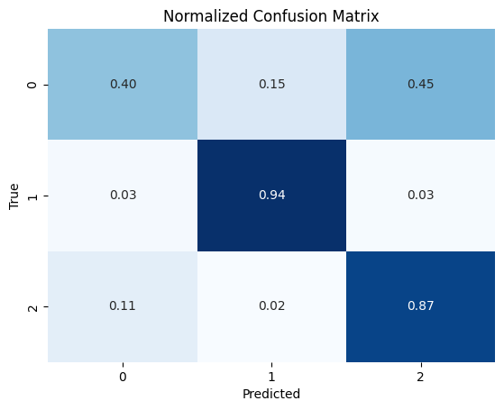

# Classifying proteins based on subcellular location using ESM2 and MLP

## Overview 
Using ESM2 tokenizer and encoder to embed protein sequences, and a small MLP to classify proteins by subcellular location (multiclass classification). 

## Data
Derived from UniProt database. 

Labels: cytosol, membrane, nucleus.

## Findings 
The model is able to identify and differentiate membrane proteins from the other 2 classes; it shows high precision and recall for these proteins. However, it struggles to differentiate between cytosolic and nuclear proteins. Cytosolic proteins show low precision and recall (0.67; 0.40), while nuclear proteins have a reasonably high recall (0.87) and low precision (0.67). Thus, the model misclassifies cytosolic proteins as nuclear at a high rate. 

* 0 = cytosol
* 1 = membrane
* 2 = nucleus

## Conclusions
This confusion between cytosolic and nuclear proteins is understandable and expected; many proteins shuttle between the cytosol and nucleus, and their location can be dependent on the cell state. There are also proteins where a fraction of them are in the nucleus and the rest are in the cytoplasm. As a result of these overlaps, they likely share similar amino acid sequences, lengths and domains. Moreover, the nuclear localization signal (NLS) is very short and variable, so it can be hard to detect. Membrane proteins on the other hand are very easily identifiable by their unique structures: they contain strong hydrophobic regions and signaling peptides. 

Database annotations can also be misleading because they are derived from context-specific studies. Thus, many proteins labelled only as cytosolic may also travel into the nucleus under different cellular conditions. 

## Future directions
Something to try would be multi-label classification, which allows multiple classes to be assigned to a single protein. Or assess top 2 accuracy instead of top 1 accuracy. 
